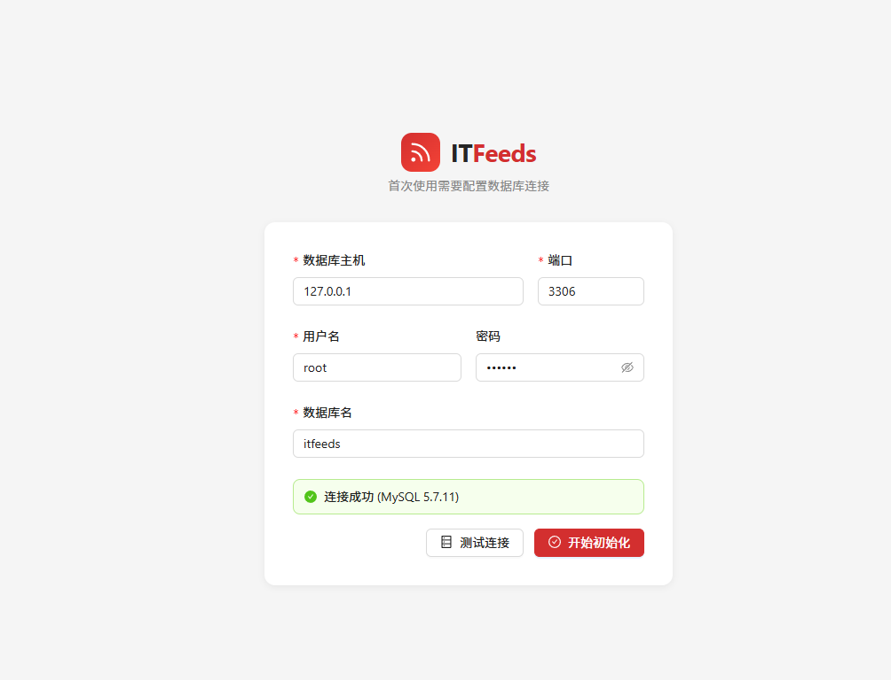
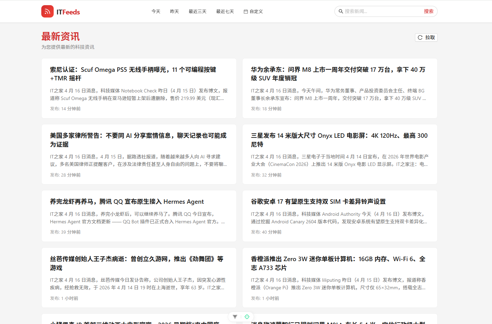
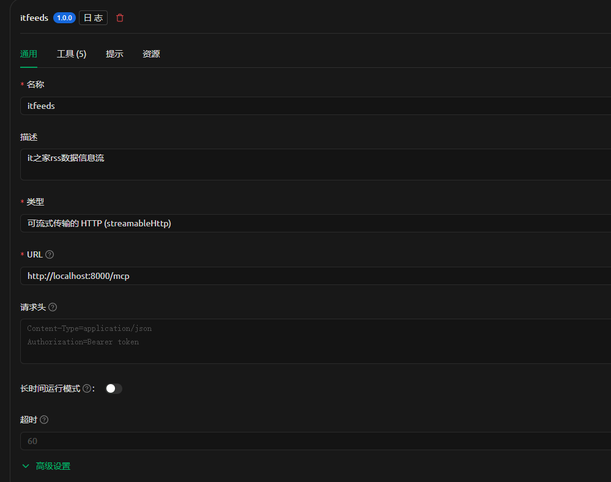
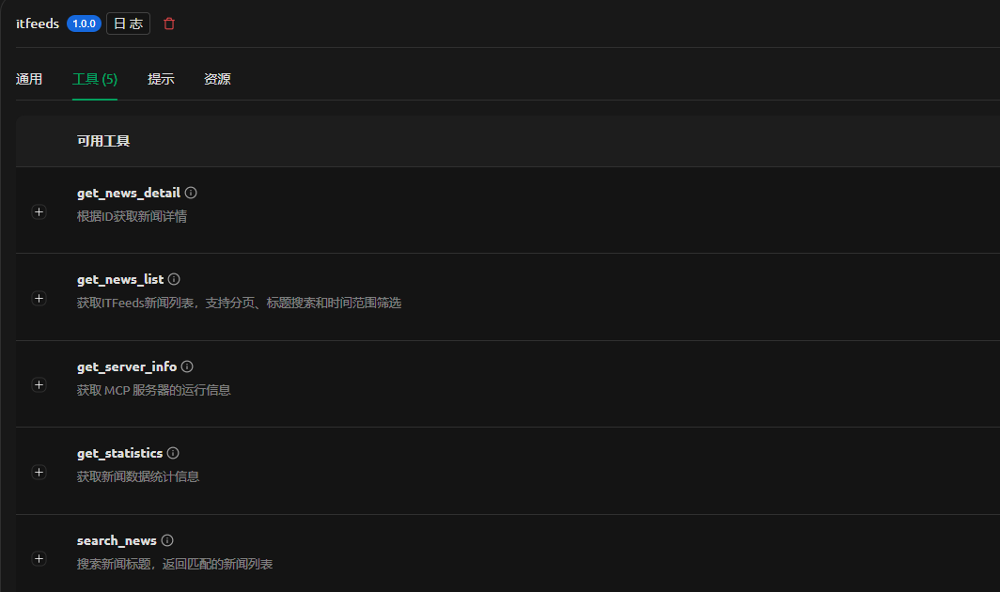

# ITFeeds

> Full-stack RSS feed aggregator with built-in MCP AI tools, web-based initialization, and Docker deployment.

**中文** | [English](README_EN.md)


## Table of Contents

- [Features](#features)
- [Screenshots](#screenshots)
- [Quick Start](#quick-start)
- [Project Structure](#project-structure)
- [API Reference](#api-reference)
- [MCP Setup](#mcp-setup)
- [Configuration](#configuration)
- [Docker Image](#docker-image)
- [Tech Stack](#tech-stack)
- [License](#license)

## Features

- **Multi-source RSS Sync** — Built-in cron scheduler with support for multiple RSS feeds, auto-deduplication
- **Web Initialization** — Configure database via browser on first Docker deploy, zero CLI needed
- **MCP AI Interface** — 5 built-in MCP tools, works with Cherry Studio and other AI clients
- **Manual Pull** — One-click RSS sync from the frontend
- **Bark Push** — Optional push notification on sync completion
- **Docker Ready** — Auto-built images pushed to GHCR via GitHub Actions

## Screenshots

<table>
<tr>
<td width="50%"></td>
<td width="50%"></td>
</tr>
<tr>
<td width="50%"></td>
<td width="50%"></td>
</tr>
</table>

## Quick Start

### Docker (Recommended)

```bash
docker compose up -d
```

Open `http://<ip>:<port>/init` in your browser to configure the database. You'll be redirected to the main page after initialization.

### Local Development

```bash
go mod tidy
cd web && npm install
cp manifest/config/config.example.yaml manifest/config/config.yaml
# Edit manifest/config/config.yaml with your database connection
gf run
# In another terminal
cd web && npm run dev
```

### Requirements

- Go 1.23+
- Node.js 18+
- MySQL 5.7+ (MySQL only)

## Project Structure

```
itfeeds/
├── api/v1/                    # API definitions
├── internal/
│   ├── cmd/                   # Entry point
│   ├── controller/            # Controllers
│   ├── dao/                   # Data access (auto-generated)
│   ├── logic/
│   │   ├── rss_entries/       # RSS entry business logic
│   │   ├── rss_sync/          # RSS sync scheduler
│   │   └── init/              # System initialization
│   ├── mcp/                   # MCP service
│   ├── model/                 # Data models
│   ├── service/               # Service interfaces
│   └── router/                # Route registration
├── manifest/config/           # Configuration
├── resource/
│   ├── public/                # Frontend static assets
│   └── sql/mysql/             # SQL scripts
├── scripts/                   # Build scripts
├── web/                       # Vue 3 frontend
├── Dockerfile
├── docker-compose.yaml
└── .github/workflows/         # CI/CD
```

## API Reference

### REST API

| Method | Path | Description |
|--------|------|-------------|
| GET | /api/v1/health | Health check |
| GET | /api/v1/rss_entries/list | News list (paginated) |
| GET | /api/v1/rss_entries/detail?id=N | News detail |
| POST | /api/v1/rss_entries/sync | Manual RSS pull |
| GET | /api/v1/init/status | Initialization status |
| POST | /api/v1/init/test-connection | Test database connection |
| POST | /api/v1/init/setup | Run initialization |

### MCP Tools

Endpoint: `POST /mcp` (Streamable HTTP)

| Tool | Description | Parameters |
|------|-------------|------------|
| get_server_info | Server runtime info | None |
| get_news_list | News list | `page_num` `page_size` `title` `start_date` `end_date` |
| get_news_detail | News detail | `id` *(required)* |
| search_news | Search news | `keyword` *(required)* `limit` |
| get_statistics | News statistics | None |

## MCP Setup

Add an MCP Server in your AI client, select **Streamable HTTP** type, and set the URL to `http://localhost:8000/mcp`.

> Replace `localhost:8000` with your actual address for Docker deployments.

## Configuration

RSS sync settings in `manifest/config/config.yaml`:

```yaml
rss:
  enabled: true                    # Enable scheduled sync
  crons:                           # 6-field cron (sec min hour day month weekday)
    - "0 0 8-21 * * *"
    - "0 30 8-20 * * *"
  feeds:                           # RSS feed URLs, supports multiple
    - "https://www.ithome.com/rss"
  barkPush: ""                     # Bark push key (leave empty to disable)
```

- **crons** — 6-field cron expressions, supports array for multiple schedules
- **feeds** — Add any RSS feed URLs, synced sequentially with per-feed error isolation
- **barkPush** — [Bark](https://github.com/Finb/bark-server) push key for sync notifications

## Docker Image

Images are hosted on GitHub Container Registry. Push a `v*` tag to trigger auto-build:

```bash
docker pull ghcr.io/cicbyte/itfeeds:latest
docker pull ghcr.io/cicbyte/itfeeds:1.0.0
```

## Tech Stack

| Layer | Technology |
|-------|------------|
| Backend | GoFrame v2.10.0 / gcron / mcp-go |
| Frontend | Vue 3 / Vite / Ant Design Vue 4 / Pinia / Vue Router |
| Database | MySQL 5.7+ |
| Deployment | Docker / GitHub Actions / GHCR |

## License

[MIT](LICENSE)
